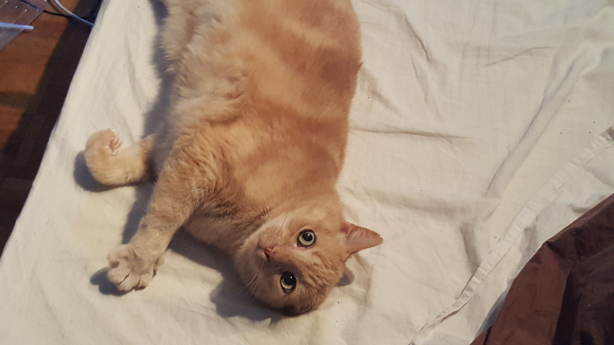

## Hello from France!

 

### About me 🙂

I'm a french developer working from Saint Etienne. I'm currently learning from the [Jean Monnet University](https://fac-sciences.univ-st-etienne.fr/en/departments/computer-science-department.html).

### Languages 🖥️

I mainly know JavaScript, Python, Java and C, but I have bases in many other languages like OCaml, Kotlin, Prolog, R.

### Frameworks 🌎

I've used some frameworks mainly for Web, Machine Learning and Network developpement

**Web** - [Vue.JS 2/3](https://vuejs.org/) (JS, Front-End), [Express](http://expressjs.com/) (JS, Back-End) [Spring](https://spring.io/) (Java, Back-End) and [Flask](https://flask.palletsprojects.com/en/1.1.x/) (Python, Back-End).

**Network** - [Netty.io](https://netty.io/) (Java)

**Machine Learning** - [Tensorflow 2](https://www.tensorflow.org/) (Python), [scikit-learn](https://scikit-learn.org/) (Python).

### OS/Scripts 🖱️

I'm from the team Microsoft with Windows 10 and Powershell 7, but I also know the couple Unix/Bash.

### My projects 🌵

You can know me from some of my projects

* Minecraft mods on CurseForge: [My projects on CurseForge](https://www.curseforge.com/members/ate48/projects)
* A ClientQuery wrapper for Teamspeak 3: [TSClientQuery_Java](https://github.com/ate47/TSClientQuery_Java-Client)
* Some university projects like
  * A compiler: [CPYRR](https://github.com/ate47/CPYRR)
  * A multiplayer web mobile game in Java/JavaScript: [Atlas](https://github.com/ate47/S6Project---Atlas---Game)
  * A Space Invaders implementation using the MLV library: [Space Invaders](https://github.com/ate47/Space-invaders)
* [Maven Packages](PACKAGE.md)

### Discord 🎮

If you want to talk with me without talking about an issue or a PR, my test server is here: https://discord.gg/wNH73Sg

### Tool box (for myself) 📐

[AtianConfig repo](https://github.com/ate47/AtianConfig)

### Caty bye

**Have a nice day with this picture of my cat** ❤️

